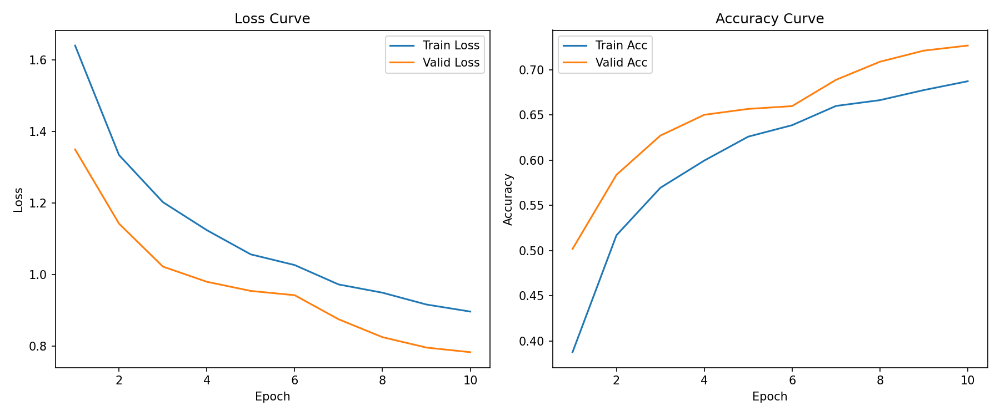

以下に、本プロジェクトの概要・使用方法などを網羅した `README.md` のサンプルを提示します。研究や実務の現場でそのまま使用・改変いただけます。必要に応じて独自の手順やライセンス情報を追記してください。

---

# PyTorch を用いた画像分類 (CIFAR-10) プロジェクト

本リポジトリは、PyTorch を用いて画像分類タスク（CIFAR-10）に取り組むためのテンプレートコードを提供します。研究・学習用から実運用を視野に入れた拡張まで、幅広く応用可能な構成となっています。



---

## 目次

1. [概要](#概要)
2. [特徴](#特徴)
3. [環境要件](#環境要件)
4. [セットアップ](#セットアップ)
5. [コード構成](#コード構成)
6. [実行方法](#実行方法)
7. [実験パイプライン (主な流れ)](#実験パイプライン-主な流れ)
8. [ハイパーパラメータの調整](#ハイパーパラメータの調整)
9. [主な拡張・応用例](#主な拡張応用例)
10. [ライセンス](#ライセンス)

---

## 概要

- **目的**  
  CIFAR-10 の画像分類を題材に、学習・評価の一連の流れを示します。  
  本コードは、**研究レベル**でも使用できるよう、下記の要素を含んでいます。
  - デバイス自動判定 (Apple Silicon MPS / CUDA / CPU)
  - 学習進捗表示 (tqdm)
  - 学習曲線可視化 (matplotlib)
  - 多彩な評価指標 (scikit-learn)
  - Numba によるカスタムメトリクスの高速化例

- **想定データセット**  
  [CIFAR-10](https://www.cs.toronto.edu/~kriz/cifar.html) (32×32 カラー画像 10クラス)。  
  実際の研究・業務では独自データやより大規模なデータセットに置き換えて使用できます。

---

## 特徴

1. **デバイスの自動検出**  
   Apple Silicon (MPS) または CUDA (GPU) が有効なら自動で使用。 CPU しかない環境でもそのまま動作します。

2. **Numba 活用の例**  
   高速化したい処理を簡単に追加可能。Python でボトルネックとなる部分を最適化できます。

3. **進捗可視化**  
   `tqdm` により、学習・検証プロセスの進捗状況をリアルタイムに把握できます。

4. **結果の詳細な評価**  
   `sklearn.metrics.classification_report` を用いて Precision, Recall, F1-score をレポート、`confusion_matrix` で分類ミスのパターンを把握できます。

5. **柔軟なネットワーク構成**  
   例として CNN を実装していますが、ResNet や Vision Transformer など、他のアーキテクチャに置き換え可能です。

---

## 環境要件

以下のパッケージ・ライブラリを使用します。

- **Python** 3.7 以上 (推奨: 3.8+)
- **numpy**
- **matplotlib**
- **tqdm**
- **PyTorch** (mps や cuda が使える環境なら GPU/MPS 使用可)
- **scikit-learn**
- **numba**

**ハードウェア**  
- Apple Silicon チップ搭載 Mac もしくは NVIDIA GPU を搭載したシステム、または CPU 環境。

---

## セットアップ

1. **リポジトリをクローン**
   ```bash
   git clone https://github.com/your-username/your-repo-name.git
   cd your-repo-name
   ```

2. **仮想環境 (venv など) を作成・アクティベート (任意)**  
   ```bash
   python -m venv venv
   source venv/bin/activate     # Mac/Linux
   # または
   .\venv\Scripts\activate      # Windows
   ```

3. **必要なライブラリをインストール**  
   ```bash
   pip install -r requirements.txt
   ```
   > `requirements.txt` がない場合は、以下のように個別インストールしてください:
   > ```bash
   > pip install numpy matplotlib tqdm torch torchvision scikit-learn numba
   > ```

---

## コード構成

```
your-repo-name/
├── data/
│   └── ...              # CIFAR-10 がダウンロードされるデフォルトパス (自動生成)
├── checkpoints/
│   └── model_cifar10.pth  # 学習済みモデル保存用フォルダ (自動生成)
├── training_curve.png   # 学習・検証曲線の画像 (実行後に生成)
├── main.py              # メイン実行スクリプト
├── README.md            # 本ファイル
└── requirements.txt     # 必要ライブラリ (任意)
```

- **`main.py`**  
  - 学習・検証・テストを一括で実行するスクリプト  
  - 実行すると、自動的に CIFAR-10 をダウンロードし、学習→検証→テスト→モデル保存まで行います。

---

## 実行方法

以下のコマンドを実行するだけで、CIFAR-10 の学習～評価～保存を完了します。

```bash
python main.py
```

- 学習が完了すると:
  1. 学習・検証の損失曲線および精度曲線 (`training_curve.png`)
  2. テストセットに対する Precision, Recall, F1-score, Confusion Matrix  
  3. 学習済みモデル (`checkpoints/model_cifar10.pth`)  

が出力されます。

---

## 実験パイプライン (主な流れ)

1. **デバイス選択**  
   - Apple Silicon (MPS) または CUDA が使用可能かチェックし、最適なデバイスを割り当てる。

2. **データローダ作成**  
   - CIFAR-10 をダウンロードし、80% を訓練データ・20% を検証データに分割。  
   - テストデータも別に用意し、バッチ単位で読み出し可能な `DataLoader` を構築。

3. **モデル定義 (CNN)**  
   - 3層の畳み込み層 + BatchNorm + ReLU + MaxPooling + 全結合層 + Dropout からなるシンプルなネットワーク構成。

4. **学習 (Train) & 検証 (Validation)**  
   - 各エポックで学習を行い、検証データでの損失と精度を算出。  
   - `tqdm` で進捗状況を可視化。  
   - 損失・精度の履歴を保存して学習曲線を後ほどプロット。

5. **テスト (Evaluation)**  
   - 学習後のモデルに対してテストセットで精度検証。  
   - `scikit-learn` の `classification_report` で詳細指標、`confusion_matrix` でミス分布を可視化。  
   - Numba を使った高速カスタムメトリクス（例: Accuracy）を実行可能。

6. **モデル保存**  
   - 学習済み重みを `checkpoints/model_cifar10.pth` に保存し、再利用できるようにする。

---

## ハイパーパラメータの調整

コード中の `main()` にて、以下の値を適宜変更してください。

- `batch_size` (デフォルト: 128)
- `num_epochs` (デフォルト: 10)
- `learning_rate` (デフォルト: 1e-3)
- `num_classes` (CIFAR-10 は10だが、独自データに合わせて変更)
- データ拡張 (RandomHorizontalFlip など)  
- オプティマイザ (Adam 以外に SGD, RMSprop, AdamW など)

---

## 主な拡張・応用例

1. **ネットワーク構造の変更**  
   ResNet, VGG, EfficientNet, Swin Transformer など、研究・業務目的に合わせたモデルに切り替え可能です。

2. **独自データセットの利用**  
   - 独自の `Dataset` クラスや画像フォルダ構成を作成し、`DataLoader` に読み込み。  
   - CIFAR-10 特有の 32×32×3 前提部分 (チャネル数、正規化パラメータ等) を修正。

3. **学習率スケジューラの導入**  
   - `torch.optim.lr_scheduler` を使用し、エポックごとに学習率を動的に変更可能です。

4. **Numba のさらなる活用**  
   - 大規模データの前処理や集計関数を最適化し、Python 上の計算ボトルネックを削減できます。

5. **実運用を見据えた実験管理**  
   - [Hydra](https://github.com/facebookresearch/hydra) や [Weight & Biases](https://wandb.ai/), [MLflow](https://mlflow.org/) などを導入し、実験設定・結果を体系的に管理できます。

---

## ライセンス

本プロジェクトのコードは、特に明記がない場合 [MIT License](./LICENSE) のもとで公開します。  
学習用・研究用・商用利用など、自由にご利用ください。  
ただし、本リポジトリが組み込んでいる各種ライブラリやデータセット(CIFAR-10)には、それぞれ固有のライセンスが存在します。そちらもご確認のうえご利用ください。

---

以上が本プロジェクトにおける `README.md` の一例です。研究や実務の要件に合わせてセクションの追加・修正を行い、より充実したドキュメンテーションを作成していただければ幸いです。